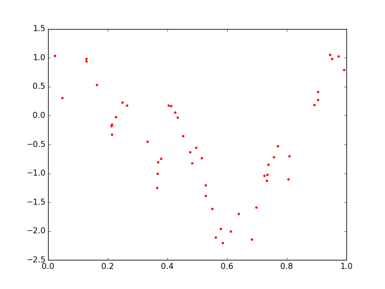
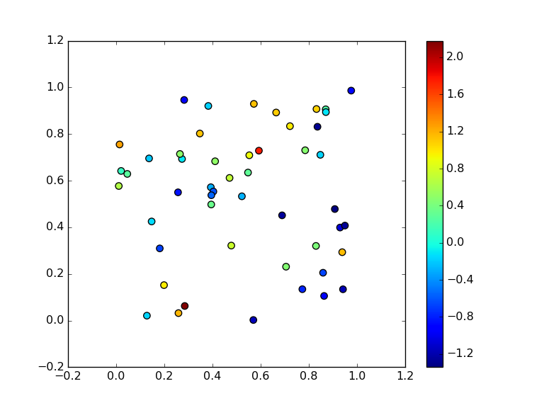
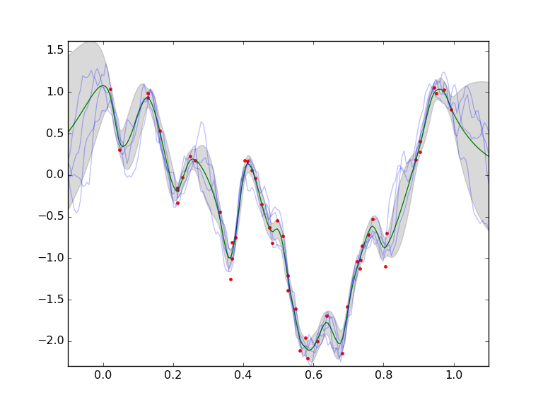
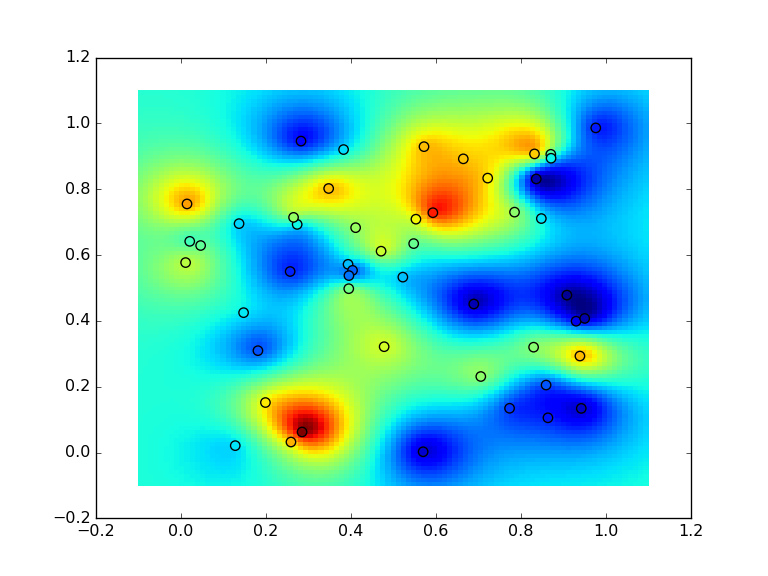
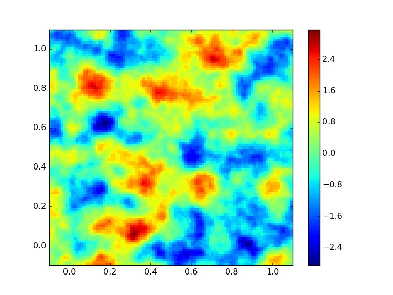

[](
using Weave
weave("homework1.mdw", plotlib="PyPlot", doctype="pandoc")
)

# Homework 1 (due April 11)


## Intro
This exercise will give you some practice working with Gaussian random fields and programing in Julia.

To start the exercises you will need packages `PyPlot` and `HDF5` (for saving and loading data).
````julia
using PyPlot, HDF5
````


Then you need to download the following two data sets and load them into Julia
```julia
download("https://github.com/EthanAnderes/STA250CMB.jl/homework/homework1/data_set1.h5")
download("https://github.com/EthanAnderes/STA250CMB.jl/homework/homework1/data_set2.h5")
```

Now load them into Julia
````julia
julia> x1d_obs    = h5read("data_set1.h5", "x1d_obs")
50-element Array{Float64,1}:
 0.0215986
 0.0464096
 0.127262 
 0.127378 
 0.162191 
 ⋮        
 0.943566 
 0.950426 
 0.973488 
 0.99185  

julia> x2d_obs    = h5read("data_set2.h5", "x2d_obs")
50x2 Array{Float64,2}:
 0.392851  0.571948
 0.571511  0.929453
 0.147136  0.425074
 0.784455  0.730485
 0.470589  0.611858
 ⋮                 
 0.705097  0.23109 
 0.477765  0.321652
 0.949496  0.407473
 0.347244  0.802329

julia> fx1d_obs   = h5read("data_set1.h5", "fx1d_obs")
50-element Array{Float64,1}:
 1.03875 
 0.305059
 0.938164
 0.985229
 0.534021
 ⋮       
 1.05218 
 0.988185
 1.03088 
 0.79018 

julia> fx2d_obs   = h5read("data_set2.h5", "fx2d_obs")
50-element Array{Float64,1}:
 -0.300057
  1.13975 
 -0.138776
  0.469284
  0.719076
  ⋮       
  0.45747 
  0.753197
 -1.26907 
  1.13239 

````


The first data set corresponds to observations of a random field on $\Bbb R$ with additive iid Gaussian noise.
In particular the data is $d_1,\ldots, d_{50}$ where
\[
d_i = f(x_i) + 0.15 \epsilon_i
\]
where $\epsilon_i$ are iid N(0,1). Here is a plot.

````julia
plot(x1d_obs, fx1d_obs, "r.", label="obs with noise")
````





The second data set corresponds to observations of a random field on $\Bbb R^2$ with additive iid Gaussian noise.
In particular the data is $d_1,\ldots, d_{50}$ where
\[
d_i = f(x_i, y_i) + 0.1 \epsilon_i
\]
where $\epsilon_i$ are iid N(0,1). Here is a plot

````julia
scatter(x2d_obs[:,1], x2d_obs[:,2], c=fx2d_obs, s = 50, vmin = minimum(fx2d_obs), vmax = maximum(fx2d_obs))
colorbar()
````





I generated both data sets using one of the following covariance functions (but I'm not telling you which).
````julia
cov1(x,y) = exp(-norm(x-y))
cov2(x,y) = (norm(x)^0.85 + norm(y).^0.85 - norm(x-y).^0.85)
function cov3(x,y)
	ν    = 1.2
	ρ    = 0.01
	σ²   = 1.0
	arg  = √(2ν/ρ) * norm(x-y)
	if arg == 0.0
		return σ²
	else
		rtn  = arg^ν
		rtn *= besselk(ν, arg)
		rtn *= σ² * 2^(1-ν) / gamma(ν)
		return rtn
	end
end
````


Simply using the fact that the finite dimensional distributions of a Gaussian random field are multivariate Gaussian vectors
one can compute the conditinoal expected value, conditional standard deviation and conditional simulations of the random field $f$
at finitly many spatial locations.

In particular, using `cov3(x,y)` above for the covariance model for $f(x)$ in the one dimensional data set one can
make the following plot for $E(f(x)|data)$, $std(f(x)|data)$ and conditional simulations of $f(x)$ when `x = linspace(-.1, 1.1, 200)`.





Also using `cov3(x,y)` above for the covariance model for $f(x,y)$ in the two dimensional data set one can
make the following plots for $E(f(x,y)|data)$ and conditional simulations of $f(x,y)$ when
 $(x,y)$ in a 2-d grid with side spaceing given by `linspace(-.1, 1.1, mesh_side)`. Here is a plot of the conditinoal expected value.





Here is a plot of a conditional simulation of $f(x,y)$ on the same grid.




## What you need to do

Your assignment is to reproduce the above plots using each one of the above covariance models for $f$ (they don't have to look exactly the same but basically show the same thing).

## Tips

Here is the code I used to generate the two data sets

```julia
n         = 50              # <-- number of observation locations
x1d_obs   = sort(rand(n))   # <-- observation locations
Σ         = Float64[cov(xi,yi) for xi in x1d_obs, yi in x1d_obs]
Σobs      = Σ +  (0.15)^2 * eye(n)
chlΣobs   = chol(Σobs, Val{:L})
fx1d_obs  = chlΣobs * randn(n)
h5write("data_set1.h5", "x1d_obs", x1d_obs)
h5write("data_set1.h5", "fx1d_obs", fx1d_obs)
```


```julia
n         = 50
x2d_obs   = rand(n,2)
Σ         = Float64[cov(vec(x2d_obs[i,:]), vec(x2d_obs[j,:])) for i in 1:n, j in 1:n]
Σobs      = Σ +  (0.1)^2 * eye(n)
chlΣobs   = chol(Σobs, Val{:L})
fx2d_obs  = chlΣobs * randn(n)
h5write("data_set2.h5", "x2d_obs", x2d_obs)
h5write("data_set2.h5", "fx2d_obs", fx2d_obs)
```


Note the use of comprehensions for generating the covariance matrix `Σ` for $f$ at the observation locations.
In your exercise you'll need to also compute the cross covariance of $f$ at the predicted points with the observations locations
and the covariance of $f$ at the prediction points. Here is how I generated them

In the 1-d case
```julia
x1d_pre    = linspace(-.1, 1.1, 200)
Σcross     = Float64[cov(xi,yi) for xi in x1d_pre, yi in x1d_obs]
Σpre       = Float64[cov(xi,yi) for xi in x1d_pre, yi in x1d_pre]
```

In the 2-d case
```julia
function meshgrid{T}(vx::AbstractVector{T}, vy::AbstractVector{T})
    m, n = length(vy), length(vx)
    vx = reshape(vx, 1, n)
    vy = reshape(vy, m, 1)
    (repmat(vx, m, 1), repmat(vy, 1, n))
end
meshgrid(v)  = meshgrid(v,v)

mesh_side    = 100
xmesh, ymesh = meshgrid(linspace(-.1, 1.1, mesh_side))

# To construct Σcross and Σpre we put it in a function so it can be jit compiled
function ΣcrossΣpre(xmesh, ymesh, x2d_obs)
	n = size(x2d_obs, 1)
	m = length(xmesh)
	Σcross = Array(Float64, m, n)
	Σpre   = Array(Float64, m, m)
	@inbounds for col in 1:n, row in 1:m
		Σcross[row, col] = cov([xmesh[row], ymesh[row]], vec(x2d_obs[col,:]))
	end
	@inbounds for col in 1:m, row in 1:m
		Σpre[row, col] = cov([xmesh[row], ymesh[row]], [xmesh[col], ymesh[col]])
	end
	return Σcross, Σpre
end

@time Σcross, Σpre = ΣcrossΣpre(xmesh, ymesh, x2d_obs)

```

Note: I used comprehensions for the 1-d case but explicity wrote the loop in the 2-d case for speed.
When writing fast code in Julia you need to make sure your code is type stable. There is an easy way to check this
with the macro `@code_warntype` which tells you what types Julia was able to infer for the variables in your functions.

```julia
@code_warntype ΣcrossΣpre(xmesh, ymesh, x2d_obs)
```

 If you see any `Any` in the `Variables:` section then you have type *instability* (which is bad).
