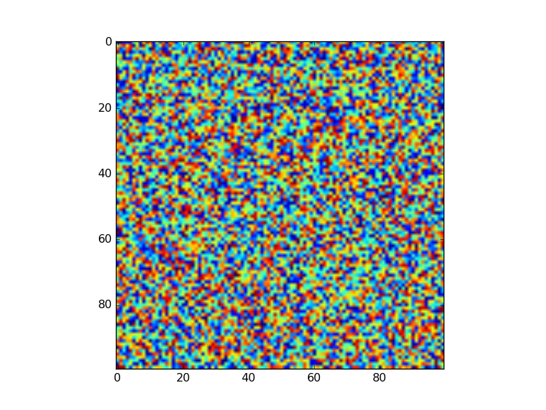
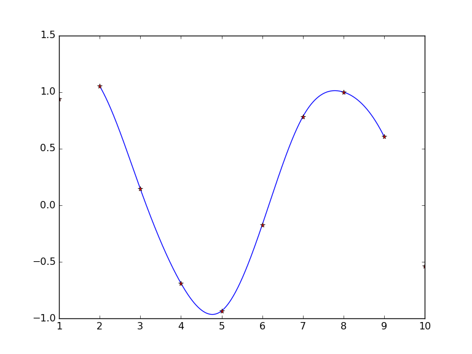

[](weave("lectures/julia_lecture1/julia_install_arrays_packages.mdw", plotlib="PyPlot", doctype="github")


#  Why I'm excited about Julia

* Open source
* High level matlab-like syntax
* Fast like C (often one can get within a factor of 2 of C)
* Made for scientific computing (matrices first class, linear algebra support, native fft ...)
* Modern features like:
  - Macros,
  - closures,
  - pass by reference,
  - OO qualities,
  - modules
  - code can be written in Unicode ( I'll never write sqrt(2) again. instead √(2) )
  - parallelism and distributed computation
  - powerful shell programming
  - named and optional arguments
  - julia notebooks
* I can finally write fast loops (not to be underestaimted)
* Since it is fast most of julia is written in julia
* Since it is high level, the source is actually readable (and a good way to learn)
* Julia interacts with python so well, any of the missing functionality can be called out to python


Installation
=============================================

There are three ways to install Julia: compile from source, download the binaries, use [homebrew](http://brew.sh).


### Compile from source
I compile Julia from source and usually put it in a directory called `Software`. You will first need to make sure you have the command line arguments installed (if your on a mac). First download X-code from the mac store and then enter `xcode-select --install` at the terminal. Now you need up-to-date gcc (and other stuff). I use homebrew for this.
```
brew install gcc
brew install Caskroom/cask/xquartz
brew install cmake
```
Once these are installed I do the following
```
cd Software
git clone -b release-0.4 git://github.com/JuliaLang/julia.git julia4
cd julia4
make
```
If this works, add `export PATH="/Users/ethananderes/Software/julia4/:$PATH"` (with `/Users/ethananderes` replaced by the path on your machine) to your `.bash_profile` and you should be able to call `julia` from the terminal.


### Download binaries
Probably the easiest way to install the Julia binaries is with homebrew (follow instructions [here](https://github.com/staticfloat/homebrew-julia/)).

If you don't want to use homebrew, you can download the binaries directly from [julialang.com](julialang.com) but you will need to add the path to Julia in your `.bash_profile` if you do it that way.


### Getting help

The documentation found at [julialang.com](julialang.com) is pretty good. You can also ask questions on Google groups (search julia). The Julia community is pretty friendly and they welcome beginners so don't hesitate to ask for help.


Python
=============================================
Most of the code you will write in this class will be in Julia. However, Physicists traditionally use python for all their data analysis so we will need to call some of the python modules written specifically for CMB analysis. Lucky python and Julia work amazing well together so this will not be a problem. If you already have python working (and have numpy, matplotlib, etc installed and working) then your already ready to go. If not, then I recommend installing anaconda which will automatically install everything we need.

To install Anaconda I recommend using the command-line installer (instructions [here](https://www.continuum.io/downloads)).

Once Anaconda is installed you can add packages using something like `conda install ...` for packages registered with conda. If you want to install a package not registered with conda you can do something like the following example (to install Pweave in python)
```
conda config --add channels mpastell
conda install pweave
```

If, at any time, you need to update Anaconda just enter the following at the terminal.
```
conda update conda
conda update anaconda
```


Julia basics
=======================================

Using Julia as a calculator.
````julia
julia> a = 1 + sin(2)
1.9092974268256817

julia> b = besselj(2, a ^ 2)
0.4376457719304935

julia> d = sin(a * b * π)
0.49383153154679066

````


Shell mode, help mode and namesapce variables
```
shell>  pwd
/Users/ethananderes/Dropbox/Courses

shell>  cd ..
/Users/ethananderes/Dropbox

help?>  besselj
search: besselj besseljx besselj1 besselj0 bessely besselk besseli besselh besselyx bessely1 bessely0 besselkx besselix besselhx


julia> whos() # variables in my namespace
```


Run a file of Julia source
```julia
include("run.jl")
```

Exit REPL and quit
```
quit()
```

To uninstall Julia, just remove binaries (this should just be one directory) and `~/.julia/`.


Intro to multidimensional arrays
=======================================
In this class you will mostly work with multidimensional arrays. These are lightweight mutable containers.


Here are a few ways to construct arrays
````julia
julia> vec1 = [1, 2, 3]  # a list (i.e. vector)
3-element Array{Int64,1}:
 1
 2
 3

julia> mat1 = [1.1 2.0 3; 4 5 6] # a matrix.
2x3 Array{Float64,2}:
 1.1  2.0  3.0
 4.0  5.0  6.0

julia> mat2 = randn(3,4)  # a matrix with N(0,1) entries.
3x4 Array{Float64,2}:
  0.334835  -0.0387339   1.90513   0.917596
  0.187311  -0.789559   -0.319016  0.0708397
 -1.27428   -0.414856   -0.475975  1.06085  

julia> mat3 = zeros(2,2,2)  # a 2x2x2 multidimentional array
2x2x2 Array{Float64,3}:
[:, :, 1] =
 0.0  0.0
 0.0  0.0

[:, :, 2] =
 0.0  0.0
 0.0  0.0

julia> mat4 = eye(5)  #<--- 5 x 5 idenity matrix
5x5 Array{Float64,2}:
 1.0  0.0  0.0  0.0  0.0
 0.0  1.0  0.0  0.0  0.0
 0.0  0.0  1.0  0.0  0.0
 0.0  0.0  0.0  1.0  0.0
 0.0  0.0  0.0  0.0  1.0

````


Accessing submatrices and elements of an array.
````julia
julia> row   = [1  2  4  6]  # rows are two dimensional
1x4 Array{Int64,2}:
 1  2  4  6

julia> mat2[1, 2] # first row, second column
-0.03873391520399528

julia> mat2[1, :] # first row
1x4 Array{Float64,2}:
 0.334835  -0.0387339  1.90513  0.917596

julia> mat2[:, 2] # second column...trailing degenerate dimensions are removed
3-element Array{Float64,1}:
 -0.0387339
 -0.789559
 -0.414856

julia> mat2[1:2, 2:end] # matrix sub block
2x3 Array{Float64,2}:
 -0.0387339   1.90513   0.917596
 -0.789559   -0.319016  0.0708397

julia> mat2[:]  # stacks the columns
12-element Array{Float64,1}:
  0.334835
  0.187311
 -1.27428  
 -0.0387339
 -0.789559
  ⋮        
 -0.319016
 -0.475975
  0.917596
  0.0708397
  1.06085  

````


Arrays are mutable so you can allocate them and fill in their entries
````julia
julia> mat5 = Array(Float64, 2,3)  # allocate a 2x3 array with Float64 entries
2x3 Array{Float64,2}:
 4.24399e-314  0.0  2.27534e-314
 1.061e-314    0.0  2.29566e-314

julia> mat5[1,2] = 0  # change the 1,2 entry to 0.0
0

julia> mat5[5] = 1000 # change the 5th entry (in column major ordering)
1000

julia> mat5
2x3 Array{Float64,2}:
 4.24399e-314  0.0  1000.0         
 1.061e-314    0.0     2.29566e-314

julia> mat5[:,1] = 22 # change everything in first column to 22 and supress output
22

julia> mat5
2x3 Array{Float64,2}:
 22.0  0.0  1000.0         
 22.0  0.0     2.29566e-314

julia> mat5[:]   = rand(2,3)  # replace all entries of mat5 with U(0,1) entries
2x3 Array{Float64,2}:
 0.991557  0.773438  0.80337
 0.626799  0.38602   0.911578

````


Vectorize operations
````julia
julia> mat1 = eye(2)
2x2 Array{Float64,2}:
 1.0  0.0
 0.0  1.0

julia> mat2 = randn(2,2)
2x2 Array{Float64,2}:
 -0.295752  1.30407
  1.23045   2.63895

julia> mat2 .^ 2 # .^ is elementwise power
2x2 Array{Float64,2}:
 0.0874691  1.70059
 1.51401    6.96405

julia> exp(mat2)
2x2 Array{Float64,2}:
 0.743972   3.68424
 3.42277   13.9985

julia> mat1 .* mat2
2x2 Array{Float64,2}:
 -0.295752  0.0    
  0.0       2.63895

julia> mat2 .<= 0
2x2 BitArray{2}:
  true  false
 false  false

julia> mat1 .<= mat2
2x2 BitArray{2}:
 false  true
  true  true

````


Finding and changing elements
````julia
julia> mat2[mat2 .<= mat1] = -1
-1

julia> mat2
2x2 Array{Float64,2}:
 -1.0      1.30407
  1.23045  2.63895

julia> find(mat2 .≥ 0) # returns a vector of linear column-wise indices
3-element Array{Int64,1}:
 2
 3
 4

````


Built in linear algebra (from BLAS and LPACK)
````julia
julia> mat2 = rand(3,3)
3x3 Array{Float64,2}:
 0.493686   0.484443  0.214623
 0.0805816  0.495454  0.764991
 0.627971   0.23784   0.416684

julia> mat2 = mat2 * mat2.' # matrix multiplication
3x3 Array{Float64,2}:
 0.524474  0.443986  0.514671
 0.443986  0.83718   0.487201
 0.514671  0.487201  0.624541

julia> d, v = eig(mat2)
([0.0574052767364541,0.29307740586135755,1.6357125076681025],
3x3 Array{Float64,2}:
 -0.742151     0.424484  -0.518676
  0.00381197  -0.771189  -0.636594
  0.670221     0.474427  -0.570721)

julia> u  = chol(mat2)
3x3 UpperTriangular{Float64,Array{Float64,2}}:
 0.724206  0.613067  0.710669
 0.0       0.679212  0.0758433
 0.0       0.0       0.337251

julia> l  = chol(mat2, Val{:L})
3x3 LowerTriangular{Float64,Array{Float64,2}}:
 0.724206  0.0        0.0     
 0.613067  0.679212   0.0     
 0.710669  0.0758433  0.337251

````


Julia packages
=======================================


Packages in Julia are hosted on github. These are saved in `~/.julia/`. Download a package with:
```julia
Pkg.add("Distributions")
```
This only needs to be done once. Loading a package into a session is done with `using`.
````julia
julia> using Distributions

julia> rand(Beta(1/2, 1/2), 10) # from the Distributions package
10-element Array{Float64,1}:
 0.565015
 0.852367
 0.210191
 0.285482
 0.0107757
 0.85996  
 0.391876
 0.950534
 0.195532
 0.944218

````


Note that in the above code, the `rand` function is overloaded by `Distributions`.


### Ploting with matplotlib using PyPlot

````julia
julia> using PyPlot

julia> x = sin(1 ./ linspace(.05, 0.5, 1_000))
1000-element Array{Float64,1}:
 0.912945
 0.825943
 0.714887
 0.58439
 0.439275
 ⋮       
 0.906264
 0.907029
 0.907789
 0.908545
 0.909297

julia> plot(x, "r--")
1-element Array{Any,1}:
 PyObject <matplotlib.lines.Line2D object at 0x335494ed0>

julia> title("My Plot")
PyObject <matplotlib.text.Text object at 0x33637b490>

julia> ylabel("red curve")
PyObject <matplotlib.text.Text object at 0x337db92d0>

````


````julia
julia> imshow(rand(100,100))
PyObject <matplotlib.image.AxesImage object at 0x333a20fd0>

````





### Using PyCall for missing libraries

````julia
julia> using PyCall

julia> @pyimport scipy.interpolate as scii

julia> x = 1:10
1:10

julia> y = sin(x) + rand(10)/5
10-element Array{Float64,1}:
  0.938935
  1.05298
  0.145303
 -0.687687
 -0.932236
 -0.172414
  0.782753
  0.999743
  0.606727
 -0.538232

julia> iy = scii.UnivariateSpline(x, y, s = 0) # python object
PyObject <scipy.interpolate.fitpack2.InterpolatedUnivariateSpline object at 0x3339e25d0>

````


Here is all the stuff in iy
````julia
julia> keys(iy)
36-element Array{Symbol,1}:
 :__call__            
 :__class__           
 :__delattr__         
 :__dict__            
 :__doc__             
 ⋮                    
 :get_knots           
 :get_residual        
 :integral            
 :roots               
 :set_smoothing_factor

````


We want the field that gives us the spline function
````julia
julia> iy[:__call__]
PyObject <bound method InterpolatedUnivariateSpline.__call__ of <scipy.interpolate.fitpack2.InterpolatedUnivariateSpline object at 0x3339e25d0>>

````


````julia
julia> yinterp(x) = iy[:__call__](x) # pull out the function part of iy
yinterp (generic function with 1 method)

julia> xnew = linspace(2, 9, 1000)
linspace(2.0,9.0,1000)

julia> plot(xnew, yinterp(xnew))
1-element Array{Any,1}:
 PyObject <matplotlib.lines.Line2D object at 0x328440d10>

julia> plot(x, y,"r*")
1-element Array{Any,1}:
 PyObject <matplotlib.lines.Line2D object at 0x328440390>

````





### Distributions package


````julia
julia> x = rand(10)
10-element Array{Float64,1}:
 0.425072
 0.228708
 0.0485751
 0.119317
 0.804846
 0.97581  
 0.6271   
 0.485521
 0.691898
 0.12989  

julia> mean(x), std(x)  # functions in Base Julia
(0.45367376793188097,0.31901806061009946)

````


````julia
julia> using Distributions

julia> λ, α, β = 5.5, 0.1, 0.9
(5.5,0.1,0.9)

julia> xrv = Beta(α, β) # creats an instance of a Beta random variable
Distributions.Beta(α=0.1, β=0.9)

julia> yrv = Poisson(λ) # creats  an instance of a Poisson
Distributions.Poisson(λ=5.5)

julia> zrv = Poisson(λ) # another instance
Distributions.Poisson(λ=5.5)

julia> typeof(xrv), typeof(yrv), typeof(zrv)
(Distributions.Beta,Distributions.Poisson,Distributions.Poisson)

````


mean is overloaded by `Distributions` to give the expected value of the random variable.
````julia
julia> mean(xrv)  # expected value of a Beta(0.1, 0.9)
0.1

````


std is overloaded to give the random variable standard deviation
````julia
julia> std(zrv)   # std of a Poisson(5.5)
2.345207879911715

````


rand is overloaded to give random samples from yrv
````julia
julia> rand(yrv, 10)  # Poisson(5.5) samples
10-element Array{Int64,1}:
 4
 8
 5
 7
 6
 3
 8
 8
 9
 6

````


````julia
julia> @which mean(xrv) # check which method is called
mean(d::Distributions.Beta) at /Users/ethananderes/.julia/v0.4/Distributions/src/univariate/continuous/beta.jl:22

````
