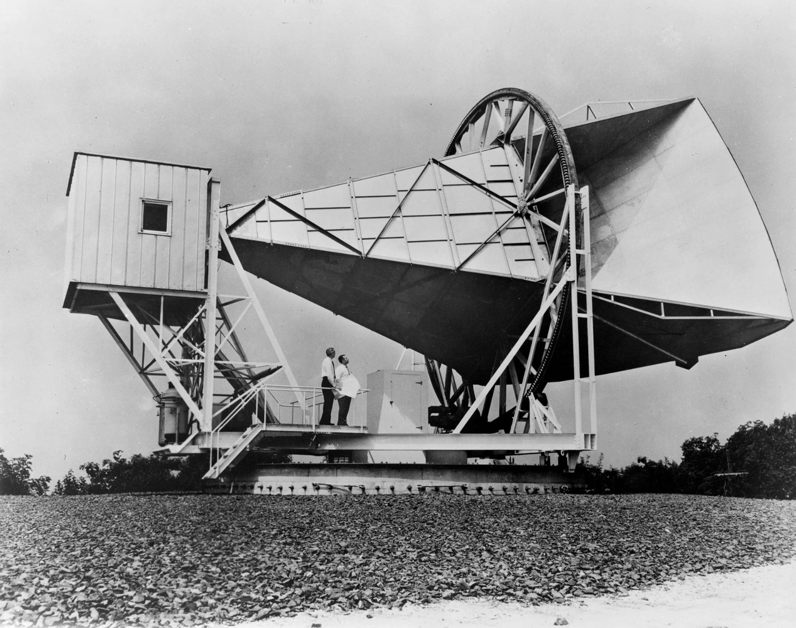
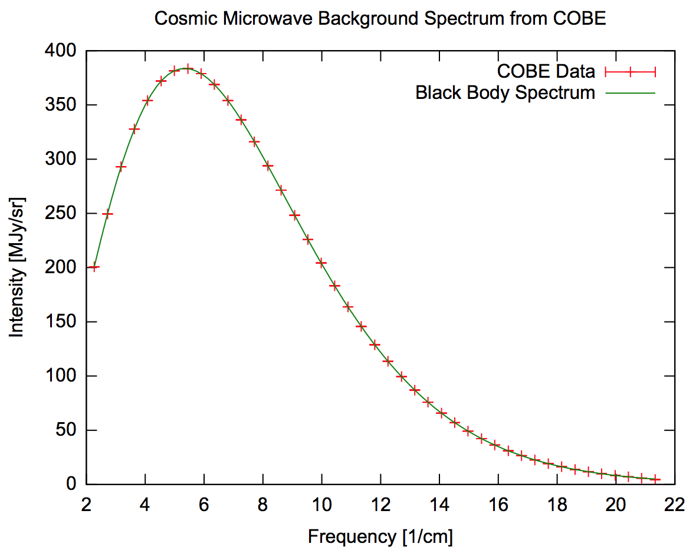
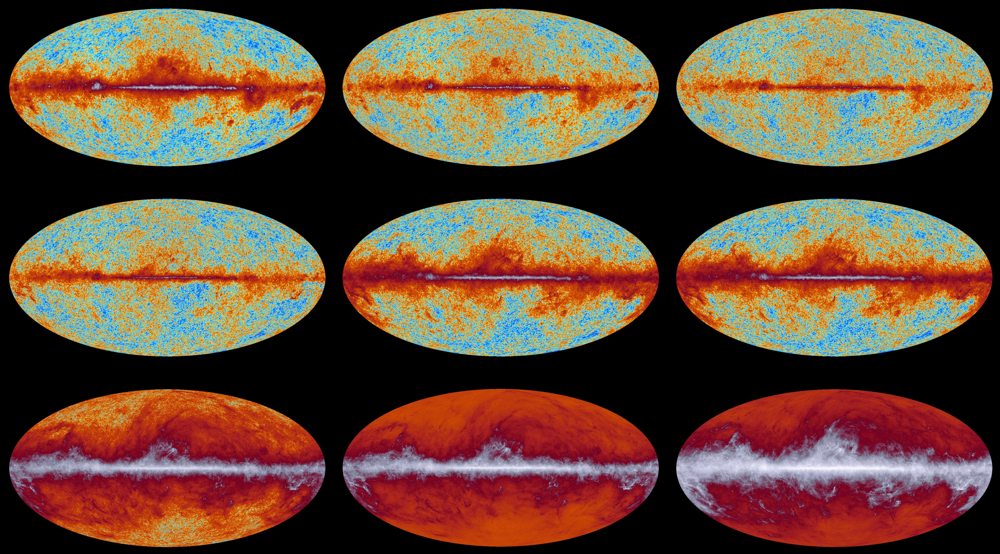
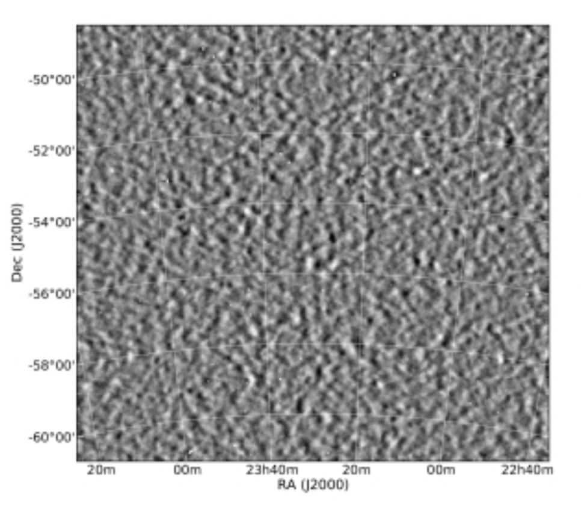
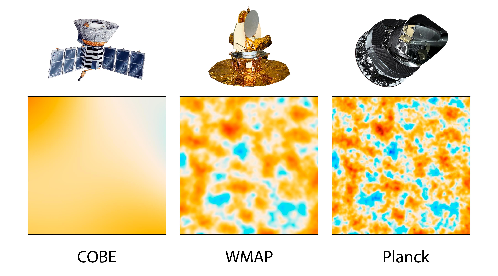
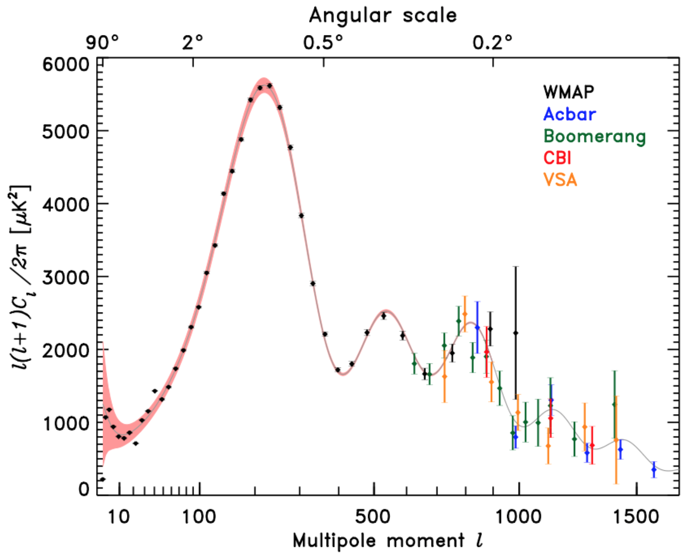
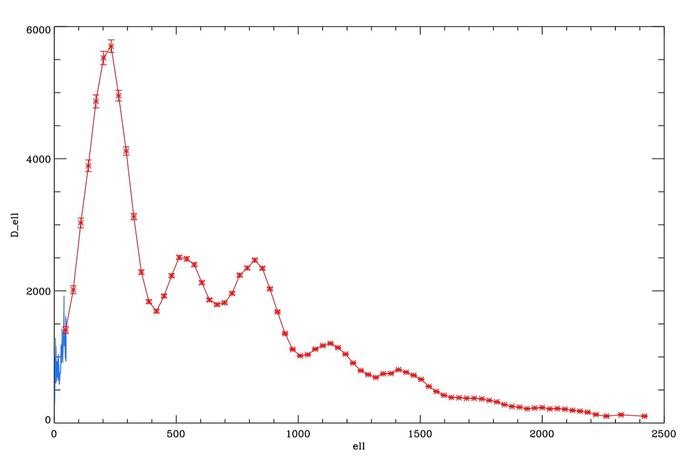
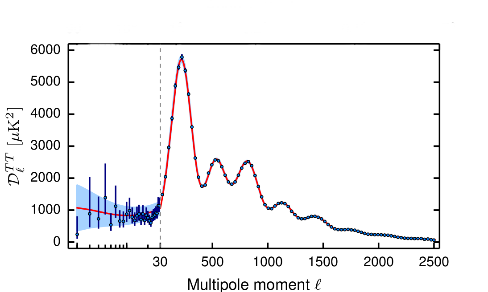
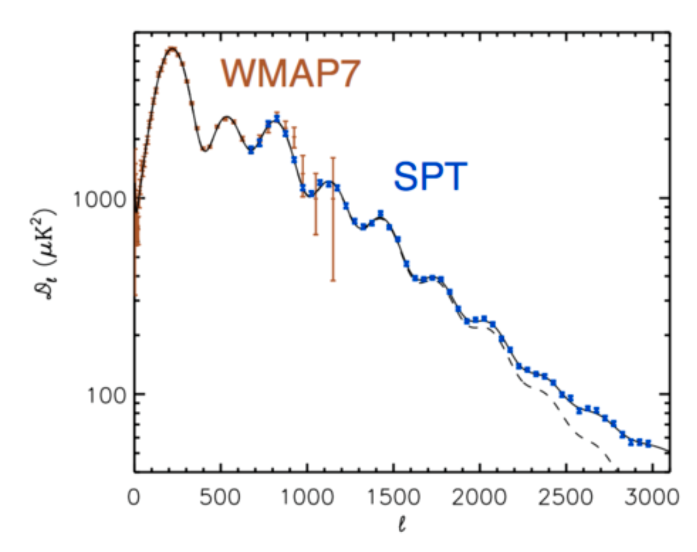

Cosmic timeline
============================================

* CMB is from about 380,000 after the big bang.

* Current universe is about 13.7 billon years old.

Holmdel Horn Antenna (60s)
==============================================

* Accidental discovery of CMB in 1964 by American radio astronomers Penzias and Wilson (a funny account in [link](https://www.youtube.com/watch?v=kvlCFyufaJ8)).

* Earned the 1978 Nobel Prize.

* Here is the Holmdel Horn Antenna on which Penzias and Wilson discovered the cosmic microwave background.

* The CMB has an (spatial) average thermal black body spectrum at a temperature of about 2.72548 K. There are tiny spatial fluctuations at about ±0.0005 K (converted to μK that is fluctuations at about ±10^6 * 0.0005 μK  = 500 μK). The map of these fluctuations are what we refer to as the CMB.

COBE (90s)
==============================================

* Graph of cosmic microwave background spectrum measured by the FIRAS instrument on the COBE, the most precisely measured black body spectrum in nature. The error bars are too small to be seen even in an enlarged image, and it is impossible to distinguish the observed data from the theoretical curve.

* 1990 – FIRAS on the Cosmic Background Explorer (COBE) satellite measures the black body form of the CMB spectrum with exquisite precision, and shows that the microwave background has a nearly perfect black-body spectrum and thereby strongly constrains the density of the intergalactic medium.

* In 2006 – Two of COBE's principal investigators, George Smoot and John Mather, received the Nobel Prize in Physics in 2006 for their work on precision measurement of the CMBR.

WMAP (2003, 2006, 2011)
=====================================================

* 2003, 2006 – The WMAP spacecraft produces a map of the whole sky are released, confirming previous analysis, correcting several points, and including polarization data.

SPT and Planck (current)
=====================================================

* Planck temperature map (satellite, covering the whole sky)

* 9 frequencies of Planck maps

* SPT temperature map (South Pole telescope, high resolution but only on parts of the sky)

* Resolution comparison between COBE, WMAP and Planck

Spectral Densities
==================================================

* WMAP spectral density estimate.

* Planck spectral density estimate.

* Another Planck spectral density estimate.

* SPT + WMAP spectral density estimates.

